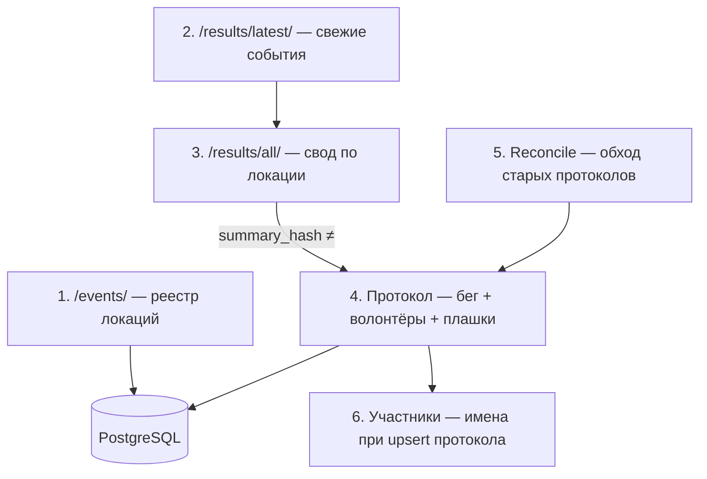

# План рефакторинга сбора статистики 5 вёрst

Документ фиксирует целевую архитектуру конвейеров синхронизации до переноса на сервер.  
**График запуска (Celery/cron)** — отдельно, после согласования логики.

---

## Текущее состояние (на момент начала работ)

| Задача | Код | Статус |
|--------|-----|--------|
| Реестр локаций | `list_park_slugs()` → `/parks/` | **Заменяется на `/events/`** (фаза A) |
| Карточка + coords | `fetch_location()` → home + `/course/` | Есть |
| Свод локации | `fetch_event_summaries()` → `/results/all/` | Есть |
| Latest по всем локам | `/results/latest/` | Нет (фаза B) |
| Протокол | `fetch_run_protocol()` + volunteers | Есть; только `is_pr` (фаза B) |
| Reconcile протоколов | legacy `update_table` | Нет (фаза C) |
| Пауза на карте | `locations.is_paused` | Поле есть; sync с 5verst — **фаза A** |
| Дубли slug | — | **Фаза A** (`location_merge_requests` + Telegram) |

Оркестрация: `app/sync/global_sync.py`, `workers/tasks/global_sync.py`, CLI `scripts/five_verst_sync_location.py`.

---

## Целевые конвейеры

---

## Скрипты и URL

| # | Скрипт | URL | Действие в БД |
|---|--------|-----|---------------|
| 1 | `five_verst_sync_registry` | `/events/` | `locations` (name, is_paused, coords, region) |
| 2 | `five_verst_sync_latest` | `/results/latest/` | summaries → events → protocols |
| 3 | `five_verst_sync_location` | `/{slug}/results/all/` | summaries; при смене hash — протокол |
| 4 | *(внутри 2–3–5)* | `/{slug}/results/{date}/` | run_results, volunteer_results, participants |
| 5 | `five_verst_reconcile_protocols` | протокол по событию | stale check + `protocol_sync_states` |
| 6 | *(inline в протоколе)* | — | `participants.display_name`, `age_category`, `club_name` |

---

## Очередь Celery и throttling (фаза инфраструктуры)

### Fetch coordinator (`app/five_verst/fetch/`)

По образцу S95: все HTTP-запросы к 5verst.ru проходят через `fetch_page_html()`:

- **Redis lock** — один активный fetch на кластер
- **Интервал** — случайная пауза `FIVE_VERST_FETCH_MIN_INTERVAL_SECONDS` … `MAX` между любыми запросами (включая профили пользователей)
- **Ban cooldown** — при 429 / captcha / cloudflare пауза `FIVE_VERST_BAN_COOLDOWN_SECONDS`

Настройки: `.env.example` (`FIVE_VERST_FETCH_*`).

### Очередь `five_verst`

Docker: `worker-five-verst` (`-Q five_verst --concurrency=1`), `beat` — расписание ниже.

**Паузы:** между HTTP-запросами 20–30 с; между выкачкой протоколов 30–40 с.

| Celery Beat | Task | Расписание (MSK) |
|-------------|------|------------------|
| `five-verst-registry-daily` | `sync_locations_registry` | ежедневно 20:00 |
| `five-verst-latest-weekday-morning` | `sync_latest_results` | пн–пт 05:00 |
| `five-verst-latest-saturday-hourly` | `sync_latest_results` | сб 01:00–23:00 каждый час |
| `five-verst-latest-sunday-hourly` | `sync_latest_results` | вс 00:00–23:00 каждый час |
| `five-verst-location-rotation` | `sync_location_rotation` | каждые 4 ч, 20 summary одной локации |
| `five-verst-reconcile-protocols` | `reconcile_stale_protocols` | каждые 3 ч, 100 старейших по `last_protocol_check_at` |

| Celery task | Назначение |
|-------------|------------|
| `five_verst_sync.enqueue_locations_registry` | Реестр `/events/` |
| `five_verst_sync.enqueue_latest_results` | `/results/latest/` |
| `five_verst_sync.reconcile_stale_protocols` | Reconcile устаревших протоколов |
| `five_verst_sync.enqueue_reconcile_protocols` | Поставить reconcile в очередь |
| `five_verst_sync.enqueue_all_location_summaries` | Своды всех локаций |
| `five_verst_sync.enqueue_recent_protocols` | Протоколы по локациям (top-N summaries) |
| `five_verst_sync.sync_location` | Одна локация (summaries + protocols) |
| `five_verst_sync.sync_latest_results` | Latest + все новые/изменённые протоколы (без лимита) |
| `five_verst_sync.sync_location_rotation` | Ротация локаций: summary-only, протокол только при изменениях |

Отчёты о запуске/завершении — VK-бот (`vk_admin_notify`, `run_reported_sync`). Управление: `/sync`, `/stats` в VK.

Scheduled dedup: один прогон на pipeline за московский час (`scheduled_sync_guard.py`). Подробнее: [AGENTS.md](../AGENTS.md).

Старые имена `global_sync.*` — алиасы на ту же очередь.

---

### A1. Парсер `parse_events_page()` ✅

- Источник: https://5verst.ru/events/
- Блок `.events-columns` → `.event-block` → `li` → `a[href]`
- **Ключ:** slug из URL (`https://5verst.ru/{slug}`)
- **Имя:** текст ссылки (без маркеров статуса)
- **Статусы** из текста `li`:
  - `(отмена)` → `cancelled`
  - `(на паузе)` → `paused`
  - `(скоро)` → `preparing`
  - иначе → `active`
- Блок `.cancel-list` — одноразовые отмены на ближайшую субботу (информативно, не меняет постоянный статус)

### A2. `sync_locations_registry()` ✅

Реализация: `app/sync/five_verst_locations.py`, CLI `scripts/five_verst_sync_registry.py`, Celery `global_sync.sync_locations_registry`.

Для каждой записи реестра:

1. Если локация **уже в БД** — обновить `name`, `source_url`, `is_paused` (paused/cancelled/preparing → `true`, active → `false`); при отсутствии coords — попробовать `/course/`
2. Если **новая** — `fetch_location()`; **без coords не создавать** запись (warning в лог)
3. С coords — `upsert_location()` + `is_official_map = true`
4. Reverse geocode → `region`, уточнение `city`/`country` при необходимости

### A3. Дубли slug ✅

- Миграция `019_location_merge_requests`
- Модель `LocationMergeRequest`
- Heuristic + Telegram админу (`telegram_admin_chat_id`)

- Таблица `location_merge_requests` (pending/confirmed/rejected)
- Heuristic: новый slug + ≥5 совпадающих `event_date` с другой локацией (sample `/results/all/`)
- Telegram админу со ссылками old/new — **ручное подтверждение merge**

### A4. Список slug для batch-sync ✅

- `list_location_slugs()` читает `/events/` вместо `/parks/`
- `list_park_slugs()` — alias для обратной совместимости

---

## Фаза B — события и протоколы

| # | Задача | Статус |
|---|--------|--------|
| B1 | Парсер `/results/latest/` + `sync_latest_results()` | ✅ |
| B2 | При смене `summary_hash` всегда тянуть протокол; `fetch_all_protocols_on_change` | ✅ |
| B3 | Миграция + парсер плашек (PR, первая пробежка, первая в локации, клуб) + `participants` | ✅ |
| B4 | Fixtures + тесты (`test_five_verst_protocol_sync.py`) | ✅ |

Общий модуль протокола: `app/sync/five_verst_protocol.py` (`fetch_and_upsert_event_protocol`).

---

## Фаза C — reconcile и наблюдаемость

| # | Задача | Статус |
|---|--------|--------|
| C1 | `protocol_sync_states` + `reconcile_stale_protocols` | ✅ |
| C2 | Единый `SyncRun` по типам (`five_verst:latest`, `five_verst:location:*`, `five_verst:reconcile_protocols`) | ✅ |
| C3 | CLI: `five_verst_sync_registry`, `five_verst_sync_latest`, `five_verst_sync_location`, `five_verst_reconcile_protocols` | ✅ |
| C4 | Celery tasks (без финального cron до согласования) | ✅ |

---

## Фаза D — карта и UX

| # | Задача | Статус |
|---|--------|--------|
| D1 | `is_paused` → серые маркеры + бейдж в таблице | ✅ (карта + таблица) |
| D2 | Локации без coords не на карте; retry `/course/` в registry + `backfill_location_geo --fetch-coords` | ✅ |
| D3 | `region` в API + reverse geocode при registry/backfill | ✅ |
| D4 | Таблица всех площадок под картой (спойлер, фильтры, сортировка, первый визит) | ✅ |

API: `GET /locations/catalog/table` — все официальные площадки по системам с флагом `visited` и `first_visit_date` пользователя.

CLI backfill: `python -m scripts.backfill_location_geo --limit 50` (region/city/country); `--fetch-coords` для retry `/course/` у 5 вёрst.

---

## Фаза E — перед prod

| # | Задача |
|---|--------|
| E1 | Сверка counts с legacy по slug |
| E2 | Чеклист готовности к деплою |
| E3 | Rate limits / ban detection |

---

## Риски

| Риск | Решение |
|------|---------|
| Нет coords на `/course/` | Не создавать локацию; не падать; retry при следующем registry sync |
| Переименование | Upsert `name` по slug |
| Новый slug = старая локация | Heuristic + Telegram + ручной merge |
| Отмена / возобновление | `is_paused` из `/events/` каждый registry sync |
| Плашки кроме PR | Фаза B3 |
| Тихие правки в старых протоколах | Фаза C1 |

---

## Порядок реализации

1. ~~**Фаза A**~~ — registry `/events/` ✅
2. ~~**Фаза B**~~ — latest + протокол + participants ✅
3. ~~**Фаза C**~~ — reconcile + CLI + Celery ✅
4. ~~**Фаза D**~~ — карта и UX ✅
5. **Фаза E** — prod + **legacy ETL** (без scrape-backfill dev БД)
6. ~~**S95**~~ — [s95_sync_plan.md](./s95_sync_plan.md) (следующий блок работ)
