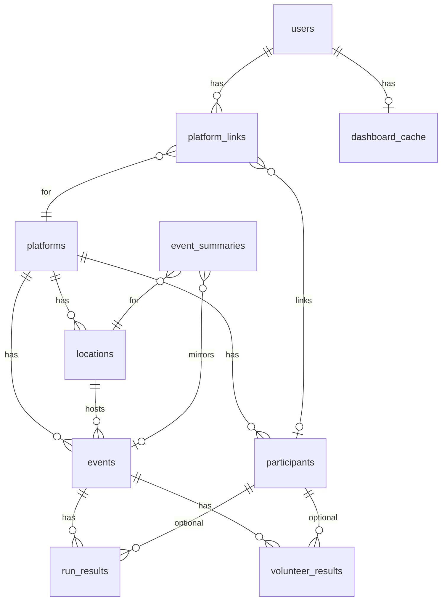

# Миграция данных: legacy → saturday_runs_lk

Документ для первого этапа миграции: **схема «откуда → куда»** и порядок загрузки.  
Legacy: PostgreSQL `five_verst_stats` (read-only). Новая БД: `saturday_runs_lk`.

Схема legacy снята с prod **2026-06-05**. Детали объёма и рисков — в [deploy_and_migration_plan.md](./deploy_and_migration_plan.md).

---

## 1. Как устроены данные в новой БД



**Идея:** legacy хранит «плоские» протоколы по `name_point` + `date_event`. Новая БД нормализует:

1. `locations` — справочник парков (slug = `external_key`)
2. `events` — конкретный старт `(platform, slug, date)`
3. `participants` — участник на платформе (`external_user_id`)
4. `run_results` / `volunteer_results` — строки протокола, привязанные к `event_id` + `participant_id`
5. `users` + `platform_links` — владельцы ЛК (из legacy — только Telegram-бот)

**Критично:** `external_result_key` и `external_event_key` при ETL должны совпадать с live sync (см. §6), иначе после миграции user sync создаст дубликаты.

---

## 2. Что не переносим (фаза 1)

| Legacy таблица | Причина |
|----------------|---------|
| `tg_user_profile`, `users`, `platform_links` | На новом сайте пока нет Telegram-логина; глобальные participants/results достаточны до OAuth |
| `s95_details_protocol`, `s95_details_vol`, `s95_list_all_events` | ~~Legacy S95 не обновлялся~~ — **переносим в фазе 1b** (2026-06) |
| RunPark events/runs | Только локации через `import_runpark_location_mappings.py` |
| `parkrun_old_details` | ~588k мёртвых строк, 0 пересечений с актуальными пользователями |
| `archive_*`, `change_log`, `club_*`, `january2025/2026`, `update_table` | служебные / снимки |
| `all_system_loc`, `contacts_location` | другие системы, не ЛК |
| `s95_*_copy`, `s95_*_backup` | дубликаты |
| `general_date_load_protocol`, `list_clubs` | не нужны для ЛК |

RunPark и каталог локаций — **не из legacy**, а из скриптов репозитория (`location_catalog`, CSV, RunPark import) **до** ETL результатов.

---

## 3. Порядок загрузки (FK)

```
0. platforms          ← seed (alembic), уже есть
1. locations          ← general_location, s95_location, parkrun (slug из каталога)
2. event_summaries    ← list_all_events, s95_list_all_events (опционально, сводки)
3. events             ← list_all_events, s95_list_all_events, distinct из протоколов
4. participants       ← distinct user_id + parkrun_users + s95_runners
5. run_results        ← details_protocol, s95_details_protocol, parkrun_details_protocol
6. volunteer_results  ← details_vol, s95_details_vol, parkrun_vol_summary (сводка)
7. users              ← tg_user_profile
8. platform_links     ← user_id_5v / s95_user_id / parkrun_user_id
9. dashboard_cache    ← пересчёт для пользователей с привязками
```

Подфазы ETL (можно запускать отдельно): `five_verst` → `parkrun` → `s95` → `validate`.

**Фаза 1 (утверждено):** users/platform_links **пропускаем** до отдельного захода.

---

## 4. Маппинг по таблицам

### 4.1. Пользователи ЛК

**Legacy: `tg_user_profile` (17 столбцов)**

| Legacy столбец | Тип | → Новая таблица.столбец | Примечание |
|----------------|-----|-------------------------|------------|
| `tg_user_id` | bigint PK | `users.telegram_id` | уникален в legacy |
| `tg_username` | text | `users.telegram_username` | |
| `tg_chat_id` | bigint | `users.telegram_chat_id` | рассылки |
| — | — | `users.telegram_first_name` | в legacy нет, NULL |
| — | — | `users.telegram_last_name` | NULL |
| — | — | `users.display_name` | NULL или `@username` |
| `consent_accepted` | bool | `users.consent_accepted` | |
| `consent_ts` | timestamptz | `users.consent_ts` | |
| `news_subscribed` | bool | `users.news_subscribed` | |
| `first_start_ts` | timestamptz | — | не переносим (можно в metadata позже) |
| `january_notification` | bool | — | legacy-рассылка, не переносим |
| `user_id_5v` | text | `platform_links.external_user_id` | platform = `five_verst` |
| `profile_url` | text | `platform_links.external_url` | для 5v |
| `bound_at` | timestamptz | `platform_links.linked_at` | |
| `s95_user_id` | text | `platform_links.external_user_id` | platform = `s95` |
| `parkrun_user_id` | text | `platform_links.external_user_id` | platform = `parkrun` |
| `last_profile_change_at` | timestamptz | `platform_links.last_user_sync_at` | опционально, только 5v |
| `last_s95_change_at` | timestamptz | `platform_links.last_user_sync_at` | опционально |
| `last_parkrun_change_at` | timestamptz | `platform_links.last_user_sync_at` | опционально |
| `last_club_change_at` | timestamptz | — | не переносим |

**Дополнительно при вставке `platform_links`:**

| Источник | → `platform_links` |
|----------|-------------------|
| lookup participant | `participant_id` ← `participants.id` по `(platform_id, external_user_id)` |
| — | `sync_status` = `'idle'` |

104 пользователя без привязок → только `users`, без `platform_links`.

OAuth (VK/Яндекс) из legacy **не** мигрируется — в legacy их нет.

---

### 4.2. Пять вёрст

#### Локации — `general_location`

| Legacy | Тип | → `locations` | Примечание |
|--------|-----|---------------|------------|
| `link_point` | text | `external_key` | slug из URL `https://5verst.ru/{slug}/` |
| `name_point` | text | `name` | русское отображаемое имя |
| `city` | varchar | `city` | |
| `region` | varchar | `region` | |
| `latitude` | text | `latitude` | cast → float |
| `longitude` | text | `longitude` | cast → float |
| `is_pause` | bool | `is_paused` | |
| — | — | `platform_id` | FK → `platforms.code = 'five_verst'` |
| — | — | `country` | `'Россия'` или NULL |
| `link_point` | text | `source_url` | |
| `distance_from_cremlin`, `tz_from_moscow` | | — | не переносим |

#### События — `list_all_events`

| Legacy | Тип | → `events` | → `event_summaries` (сводка) |
|--------|-----|------------|--------------------------------|
| `name_point` | text | lookup → `location_id` | то же |
| `date_event` | timestamp | `event_date` (date) | `event_date` |
| `index_event` | bigint | `event_number` | `event_number` |
| `is_test` | bool | `is_test_event` | `is_test_event` |
| `count_runners` | bigint | `runners_count` | `finishers_count` |
| `count_vol` | bigint | — | `volunteers_count` |
| `mean_time` | time | — | `avg_time_sec` / `avg_time_display` |
| `best_time_woman` | time | — | `best_female_time_*` |
| `best_time_man` | time | — | `best_male_time_*` |
| `link_event` | text | `source_url` | `source_url` |
| `updated_at`, `last_check_at` | | — | не переносим |

**Ключ события:** `external_event_key` = `{slug}:{event_number}:{YYYY-MM-DD}` если есть номер, иначе `{slug}:{YYYY-MM-DD}` (как в `five_verst/parser.py`).

**Имена без строки в `general_location`:** slug берётся из `list_all_events.link_event` (пример: «Аллея любви» → `park10letiyaangarska`, на сайте название не менялось — парк просто не в справочнике `general_location`).

События из протокола без строки в `list_all_events` — создать `events` on-the-fly (58 prod-кейсов).

#### Пробежки — `details_protocol`

| Legacy | Тип | → `run_results` | Промежуточно |
|--------|-----|-----------------|--------------|
| `name_point` + `date_event` | | `event_id` | lookup event |
| `user_id` | text | `participant_id` | upsert `participants.external_user_id` |
| `name_runner` | text | `participants.display_name` | при создании participant |
| `link_runner` | text | `participants.profile_url` | |
| `position` | bigint | `position` | |
| `finish_time` | time | `finish_time_sec`, `finish_time_display` | |
| `age_category` | text | `age_category` | |
| `status_runner` | text | `status` | |
| — | — | `external_result_key` | `{slug}:{YYYY-MM-DD}:{user_id}` |
| `user_id` NULL + `unknown_runner` | | `external_user_id` | `unknown:{slug}:{YYYY-MM-DD}:{position}` (как live parser) |
| `updated_at` | timestamptz | `fetched_at` | опционально |

#### Волонтёрства — `details_vol`

| Legacy | Тип | → `volunteer_results` |
|--------|-----|----------------------|
| `name_point` + `date_event` | | `event_id` |
| `user_id` | text | `participant_id` |
| `name_runner` | text | participant display_name |
| `vol_role` | text | `role` |
| — | — | `external_result_key` = `{slug}:{YYYY-MM-DD}:vol:{user_id}:{role_slug}` |

Если `user_id` NULL — fallback по `name_runner` (редко), иначе пропуск / лог.

---

### 4.3. S95

#### Локации — `s95_location`

| Legacy | → `locations` | Примечание |
|--------|---------------|------------|
| `link_point` | `external_key` | slug из `s95.ru` / `s95.by` URL |
| `name_point` или `full_name_point` | `name` | |
| `city`, `region` | `city`, `region` | |
| `latitude`, `longitude` | coords | text → float |
| `is_pause` | `is_paused` | |
| — | `platform_id` | `s95` |

#### События — `s95_list_all_events`

Аналогично 5v (`events` + опционально `event_summaries`). Поля: `date_event`, `name_point`, `count_runners`, `count_vol`, `best_time_*`, `first_man`/`first_woman` → в `summary_extra` или игнор.

#### Пробежки — `s95_details_protocol`

| Legacy | → `run_results` | Примечание |
|--------|-----------------|------------|
| общие поля | как 5v | |
| `pace` | time | `pace_sec_per_km`, `pace_display` |
| `club_name` | text | `run_results.club_name` и/или `participants.club_name` |
| `link_club` | text | — |
| — | `external_result_key` | `{slug}:{YYYY-MM-DD}:{user_id}:{position}` |

#### Волонтёрства — `s95_details_vol`

Как `details_vol`, ключ как у 5v.

#### Справочник — `s95_runners`

| Legacy | → `participants` |
|--------|------------------|
| `s95_id` | `external_user_id` |
| `name_runner` | `display_name` |
| `s95_barcode` | `barcode_id` |
| `link_s95_runner` | `profile_url` |
| `planning` | `planning_location` |

Обогащает participants при ETL (merge по `s95_id`).

---

### 4.4. parkrun

#### Локации

| Legacy | → `locations` |
|--------|---------------|
| `parkrun_russia_location.name_point` | только список имён RU |
| `parkrun_details_protocol.name_point` (distinct) | + зарубежные локации on-the-fly |

**Маппинг имени → slug:** `data/location_catalog.json` + `location_catalog_links`.  
Для abroad: `slugify(name_point)`, `country` = NULL.

Специальная локация для сводки волонтёрств:

| | |
|--|--|
| `external_key` | `parkrun-summary` |
| `name` | `parkrun (сводка ролей)` |

#### Пробежки — `parkrun_details_protocol`

| Legacy | Тип | → `run_results` |
|--------|-----|-----------------|
| `user_id` | text | participant |
| `name_point` | text | → event location |
| `date_event` | timestamp | `event_date` |
| `index_event` | bigint | `events.event_number` |
| `position` | bigint | `position` |
| `finish_time` | time | finish time fields |
| `age_grade` | text | `age_category` |
| `pr` | text | `is_pr` (не пусто / не «-») |
| — | | `external_result_key` = `parkrun:{user_id}:{slug}:{YYYY-MM-DD}:{run_number}` |

#### Профили — `parkrun_users`

| Legacy | → `participants` |
|--------|------------------|
| `user_id` | `external_user_id` |
| `actual_name_runner` / `name_runner` | `display_name` |
| `actual_age_category` | `age_category` |
| `last_updated` | `fetched_at` |

#### Волонтёрства — `parkrun_vol_summary` (агрегат, без дат)

| Legacy | → `volunteer_results` |
|--------|----------------------|
| `user_id` | participant |
| `vol_role` | часть `role` |
| `count_vol` | в тексте роли: `"{role} ({count}×)"` |
| — | `event_date` = `1970-01-01` (синтетическое событие) |
| — | `external_result_key` = `parkrun:{user_id}:vol-summary:{role_slug}` |

Как в `volunteer_summary_to_canonical()` — совместимо с user sync.

---

## 5. Lookup-цепочки при ETL

```
name_point (legacy)
  → slug: parse link_point ИЛИ general_link_all_location ИЛИ location_catalog (parkrun)
  → locations.id: WHERE platform_id + external_key = slug

(slug, date_event::date)
  → events.id: WHERE platform_id + external_event_key

user_id (legacy text)
  → participants.id: WHERE platform_id + external_user_id

tg_user_profile.user_id_*
  → platform_links: после users + participants
```

In-memory кэши обязательны (~200 локаций 5v, но миллионы результатов).

---

## 6. Ключи идемпотентности (как live sync)

| Платформа | Сущность | `external_*_key` |
|-----------|----------|------------------|
| 5v | event | `{slug}:{N}:{date}` или `{slug}:{date}` |
| 5v | run | `{slug}:{date}:{user_id}` |
| 5v | volunteer | `{slug}:{date}:vol:{user_id}:{role_slug}` |
| S95 | run | `{slug}:{date}:{user_id}:{position}` |
| S95 | volunteer | как 5v |
| parkrun | run | `parkrun:{user_id}:{slug}:{date}:{run_number}` |
| parkrun | vol summary | `parkrun:{user_id}:vol-summary:{role_slug}` |

Upsert через существующий `app/sync/upsert.py` — **предпочтительно**, чтобы не расходиться с парсерами.

---

## 7. План работ (пошагово)

| # | Шаг | Результат |
|---|-----|-----------|
| **0** | Read-only `LEGACY_DATABASE_URL` на prod | доступ без риска для legacy |
| **1** | `alembic upgrade head` + import каталогов/RunPark | пустая LK со справочниками |
| **2** | `migrate_from_legacy.py --platform five_verst --dry-run` | лог counts, без записи |
| **3** | ETL 5v (locations → events → runs → vols) | ~1,64M строк |
| **4** | ETL parkrun runs + vol_summary + parkrun_users | ~783k + 50k |
| **5** | ETL s95 (locations → events → runs → vols + s95_runners) | ~164k строк |
| **6** | `--validate` SQL-сверка counts (§8) | отчёт расхождений |
| **7** | Spot-check дашбордов | ручная сверка |
| **8** | Celery beat + delta sync | догон после cutoff legacy |

**Отложено:** users/platform_links (до Telegram/OAuth merge).

Оценка: **3–5 дней** на скрипт + **0,5–1 день** на прогон/валидацию на prod.

---

## 8. Контрольные counts

| Метрика | Legacy | Новая БД |
|---------|--------|----------|
| 5v runs | 1 187 621 | `run_results` + platform five_verst |
| 5v vols | 453 052 | `volunteer_results` |
| 5v prod events | 28 965 | `events` where not test |
| s95 runs | 133 925 | |
| s95 vols | 34 233 | |
| parkrun runs | 729 020 | |
| parkrun vol summary rows | 49 581 | |
| users | 265 | |
| platform_links 5v / s95 / parkrun | 157 / 48 / 49 | |

---

## 9. Скрипт миграции

```bash
cd backend

# Репетиция без записи
python scripts/migrate_from_legacy.py --platform five_verst --dry-run

# Только локации и события
python scripts/migrate_from_legacy.py --platform five_verst --steps locations,events

# Полный 5v (долго: ~1.6M runs)
python scripts/migrate_from_legacy.py --platform five_verst

# parkrun + s95 (полный заход)
python scripts/migrate_from_legacy.py --platform parkrun
python scripts/migrate_from_legacy.py --platform s95

# только пробежки S95 (локации и события уже есть)
python scripts/migrate_from_legacy.py --platform s95 --steps events,participants,runs,volunteers

# Сверка counts
python scripts/migrate_from_legacy.py --validate --platform all --pretty
```

Флаги: `--platform`, `--dry-run`, `--batch-size`, `--limit`, `--steps`, `--validate`.

Код: `backend/app/migration/`, CLI: `backend/scripts/migrate_from_legacy.py`.  
Upsert через `app/sync/upsert.py` — ключи совместимы с live sync.

См. также: [deploy_and_migration_plan.md](./deploy_and_migration_plan.md).
