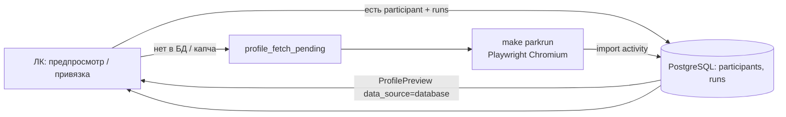

# Parkrun: очередь, БД и ЛК

Parkrun защищён капчей. В проде **нет** автоматического фонового парсинга сайта: все живые запросы либо отдают данные из БД, либо попадают в очередь и обрабатываются вручную на Mac.

## Схема



## 1. Предпросмотр и привязка (API / ЛК)

`POST /api/profiles/preview` → `preview_profile_link()`:

1. **Сначала БД** — `try_profile_preview_from_db()`. Если участник уже есть с пробежками, возвращается `ProfilePreview` с `data_source: "database"` и `data_updated_at` (дата актуальности). В UI блок `ProfileDataFreshness` показывает источник и дату.
2. **Иначе живой fetch** — адаптер parkrun (в API обычно недоступен без очереди).
3. **Капча / cooldown** — `raise_or_enqueue_fetch_error()` пишет строку в `profile_fetch_pending` и отвечает **503** с текстом про `make parkrun`.

Пользователь видит превью из БД и кнопку привязки без ожидания браузера, если профиль уже импортирован (глобально или после очереди).

## 2. Очередь `profile_fetch_pending`

| Поле | Назначение |
|------|------------|
| `platform` | parkrun |
| `external_user_id` | ID parkrunner (цифры) |
| `status` | `pending` → `done` / `failed` |
| `operation` | `profile_preview` или `activity_import` |

Источники задач:

- предпросмотр при капче;
- привязка без данных;
- админ / seed: `make parkrun-seed-queue` (5 аккаунтов из legacy `five_verst_stats`);
- повтор `failed` и «застрявшие» `done` без `PlatformLink` при следующем `make parkrun`.

## 3. Обработка на Mac

```bash
make parkrun-seed-queue   # опционально: положить тестовые ID в очередь
make parkrun              # очередь → Chromium → капча в окне → импорт в БД
```

- Сессия: `PARKRUN_PLAYWRIGHT_STORAGE_STATE_PATH` (по умолчанию `data/parkrun_playwright_state.json`).
- Между профилями — пауза `PARKRUN_FETCH_MIN/MAX_INTERVAL_SECONDS`.
- При капче на **конкретном URL** скрипт ждёт, пока **эта** вкладка станет нормальной (не считает «готово» другую вкладку, например summary без `/all`).

После успешного `activity_import` в БД появляются `participants` и `run_results`; предпросмотр в ЛК идёт из БД.

## 4. Повтор после ошибки

Строка `failed` (например, капча на `/all/`):

- снова попадёт в batch при `make parkrun` (requeue failed);
- или вручную: админка `/admin/parkrun` → «Вернуть failed в очередь».

## Переменные окружения

См. `.env.example`: `PARKRUN_*`, путь к storage state, интервалы fetch.

## Связанные файлы

- `backend/app/services/profile_linking_service.py` — порядок БД → fetch → очередь
- `backend/app/services/participant_profile_service.py` — превью из БД
- `backend/app/services/profile_fetch_pending_service.py` — очередь
- `backend/app/services/parkrun_queue_daemon.py` — daemon batch
- `backend/app/parkrun/fetch/daemon_session.py` — браузер и ожидание капчи
