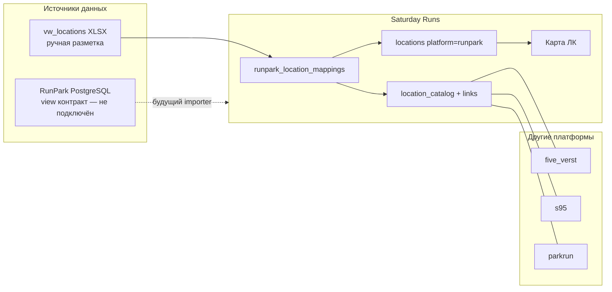

# RunPark — справочник по проекту Saturday Runs

Документ для Claude Code и разработчиков: что такое RunPark в контексте `run5k.run`, какие материалы есть в репозитории, что уже сделано и что — нет.

Обновлено: **июнь 2026**.

---

## 1. Что такое RunPark

**RunPark** ([runpark.ru](https://runpark.ru)) — четвёртая беговая система субботних парковых пробежек (наряду с 5 вёрst, S95, parkrun).

В Saturday Runs RunPark сейчас — **четвёртая платформа в модели данных**, но с **минимальной интеграцией**:

| Область | Статус |
|---------|--------|
| Платформа в БД (`platforms.code = runpark`) | ✅ есть, `is_active = false` |
| Локации на карте ЛК | ✅ 11 точек (`show_on_map`) |
| Таблица соответствий `runpark_location_mappings` | ✅ 51 запись |
| Связь с `location_catalog` / parkrun / 5v / S95 | ✅ частично |
| Синхронизация участников, пробежек, волонтёрства | ❌ **не реализовано** |
| User sync / Celery worker | ❌ нет |
| Legacy ETL из `five_verst_stats` | ❌ RunPark там **нет** |

**Вывод:** RunPark в проекте — прежде всего **каталог локаций и маппинг** к другим системам. Контракт read-only view для будущего импорта статистики описан, но **не подключён**.

---

## 2. Зачем RunPark в Saturday Runs

1. **Карта локаций** — бирюзовые маркеры RunPark рядом с 5v (синий), S95 (розовый).
2. **Склейка локаций** — многие площадки RunPark дублируют 5v/S95/parkrun; 38 из 51 помечены как `remove_from_runpark` (остаются только в других системах).
3. **Уникальные площадки** — ~10 локаций «только RunPark» (Углич, Кулибин, зарубежные и т.д.) показываются на карте.
4. **Переходные кейсы** — 2 локации `transitional` (parkrun → runpark → 5verst, статистика RunPark пока не сливается).
5. **Будущая интеграция** — контракт PostgreSQL view для read-only экспорта из БД RunPark.

---

## 3. Инвентарь файлов в репозитории

### Документация

| Файл | Содержание |
|------|------------|
| **этот файл** `docs/runpark/README.md` | Обзор для агентов |
| [`database_views.md`](./database_views.md) | Контракт view v1.0 (поля, типы, связи) |
| [`database_views.sql`](./database_views.sql) | DDL-шаблоны view `runpark_export.*` |
| [`../legacy_etl_mapping.md`](../legacy_etl_mapping.md) § | «RunPark events/runs — только локации» |
| [`../deploy_and_migration_plan.md`](../deploy_and_migration_plan.md) | RunPark не в legacy БД; import scripts |

### Данные (исходники маппинга)

| Файл | Содержание |
|------|------------|
| `data/runpark_import/vw_locations_202605271905_matched.xlsx` | **Источник правды** — ручная разметка 51 локации (колонка «решение») |
| `data/runpark_import/vw_locations_202605271905_matched.csv` | CSV-экспорт того же |
| `data/runpark_import/runpark_location_mappings.json` | Сгенерированный JSON (51 entry) для импорта в БД |

### Backend

| Файл | Содержание |
|------|------------|
| `backend/app/runpark/mappings.py` | Парсинг XLSX, классификация решений, slug из URL |
| `backend/app/runpark/__init__.py` | Пакет |
| `backend/scripts/import_runpark_location_mappings.py` | XLSX/JSON → PostgreSQL + catalog links |
| `backend/alembic/versions/017_runpark_location_mappings.py` | Таблица + платформа `runpark` |
| `backend/alembic/versions/018_runpark_mapping_is_paused.py` | Колонка `is_paused` |
| `backend/app/models/__init__.py` | Модель `RunparkLocationMapping` |
| `backend/app/location_page_url.py` | URL: `https://runpark.ru/Places/{slug}` |
| `backend/tests/test_runpark_location_mappings.py` | Тесты парсера |

### Frontend / UI

| Файл | Содержание |
|------|------------|
| `frontend/src/features/maps/UserMapPanel.tsx` | Легенда: бирюзовый = Runpark |
| `frontend/src/features/maps/mapFilters.ts` | Фильтр `runpark` на карте |
| `frontend/src/components/LocationMap.tsx` | CSS-класс `map-marker-runpark` |
| `frontend/src/index.css` | Стили маркера и легенды |
| `frontend/src/lib/format.ts` | Label `runpark: "Runpark"` |
| `frontend/public/platform-logos/options/parkrun/06-runpark.png` | Логотип (в папке parkrun logos) |

### Связанные сервисы (не только runpark, но используют)

| Файл | Роль |
|------|------|
| `backend/app/services/location_map_service.py` | Карта: `five_verst`, `s95`, `runpark` |
| `backend/app/services/location_geo_service.py` | То же |
| `backend/app/services/location_catalog_service.py` | `active_platform=runpark` — без override русского имени |
| `backend/app/services/user_unique_locations_detail.py` | Порядок платформ включает runpark |
| `data/location_catalog.json` | Несколько записей с `active_platform: "runpark"` |

### Makefile

```makefile
make runpark-mapping-import        # локально: geocode + import DB
make runpark-mapping-import-docker # через docker compose api
```

---

## 4. Модель данных

### Платформа `runpark`

Создаётся миграцией `017`. Поля:

- `code`: `runpark`
- `name`: `Runpark`
- `base_url`: `https://runpark.ru`
- `is_active`: **false** (нет fetch/sync)
- `capabilities`: все fetch-флаги **false**

### Таблица `runpark_location_mappings`

Одна строка = одна локация из экспорта RunPark (`location_id` UUID в верхнем регистре).

Ключевые поля:

| Поле | Назначение |
|------|------------|
| `runpark_location_id` | Стабильный ID из RunPark (PK логический) |
| `runpark_slug` | Из URL `/Places/{slug}` |
| `runpark_name` | Исходное название в RunPark |
| `display_name` | Отображаемое (из решения «Оставляем с названием …») |
| `decision` | `keep_runpark` / `match_parkrun` / `remove_from_runpark` / `transitional` |
| `show_on_map` | Показывать бирюзовую точку на карте |
| `is_paused` | Забеги временно не проводятся |
| `is_transitional` | Переход parkrun→runpark→5verst |
| `matched_platform` + `matched_external_key` | Дубль в 5v/S95/parkrun |
| `legacy_parkrun_slug` | Для склейки с parkrun catalog |
| `runpark_location_row_id` | FK → `locations` (строка платформы runpark) |

### Таблица `locations` (platform = runpark)

Создаётся при импорте для записей с `show_on_map=true`. Поля: координаты, city/region/country, `is_official_map=true`, `source_url`.

---

## 5. Классификация решений (маппинг)

Логика в `backend/app/runpark/mappings.py`, `classify_decision()`:

| decision | Триггер в XLSX (рус.) | show_on_map | Действие |
|----------|----------------------|-------------|----------|
| `remove_from_runpark` | «удаляем» / дубль 5v/S95 | false | Не показывать; привязка к matched_platform |
| `keep_runpark` | «Оставляем с названием "…"» | true | Уникальная RunPark-локация на карте |
| `match_parkrun` | «фиксируем "…" и мэтчим с parkrun» | true | RunPark + parkrun в catalog |
| `transitional` | «под вопросом», parkrun→runpark→5verst | false | Заметка; catalog links; merge TBD |

Ручные оверрайды в коде:

```python
MANUAL_MATCHES = {
    "gorkypark": ("five_verst", "gorkypark"),
    "mytishchicentralpark": ("five_verst", "mytishchicentralpark"),
    "zhukovsky": ("five_verst", "zhukovsky"),
}
LEGACY_PARKRUN_SLUGS = {
    "mytishchicentralpark": "mytishchicentralpark",
    "zhukovsky": "zhukovsky",
    "PushKino": "lesopark-severny",
}
```

Парсинг дубля из колонки «локация_дубль_система»:

```
five_verst: sosnovka / Сосновка (0.02 km)
s95: novgorod / ...
parkrun: ...
```

Slug RunPark из URL: `https://runpark.ru/Places/beguglich` → `beguglich`.

---

## 6. Статистика импорта (май 2026)

Источник: `data/runpark_import/runpark_location_mappings.json` (batch `vw_locations_202605271905_matched`).

| Метрика | Значение |
|---------|----------|
| Всего локаций | 51 |
| `remove_from_runpark` | 38 |
| `keep_runpark` | 10 |
| `match_parkrun` | 1 |
| `transitional` | 2 |
| `show_on_map` | 11 |
| `is_paused` | 35 |

### Локации на карте (`show_on_map = true`)

| display_name | slug | decision | paused |
|--------------|------|----------|--------|
| Лесопарк Северный | PushKino | match_parkrun | нет |
| #БегУглич | beguglich | keep_runpark | да |
| Кулибин | nn_kulibinrun | keep_runpark | нет |
| Easy RUN Antalya | antalyaeasyrun | keep_runpark | нет |
| Lake Run BA | buenosaires | keep_runpark | нет |
| Покровское-Стрешнево | pokrovskostreshnevo | keep_runpark | нет |
| Khujand | khujand | keep_runpark | да |
| Филейский парк | fileyskypark | keep_runpark | нет |
| ДзержинскРан | nn_dzerginskrun | keep_runpark | нет |
| Ньюпор Run 5К | new5run | keep_runpark | нет |
| Lake Run Tbilisi | LakeRunTbilisi | keep_runpark | нет |

---

## 7. Пайплайн импорта локаций

```
vw_locations_*.xlsx (ручная разметка)
        ↓
import_runpark_location_mappings.py
        ↓
runpark_location_mappings.json (опционально)
        ↓
PostgreSQL:
  - runpark_location_mappings
  - locations (platform=runpark, show_on_map)
  - location_catalog + location_catalog_links
```

### Команды

```bash
# Локально (нужен openpyxl, DATABASE_URL)
make runpark-mapping-import

# Docker
make runpark-mapping-import-docker

# Только JSON → DB (без XLSX)
cd backend && python scripts/import_runpark_location_mappings.py --from-json --import-db

# XLSX → JSON без DB
python scripts/import_runpark_location_mappings.py --xlsx ../data/runpark_import/vw_locations_202605271905_matched.xlsx
```

Флаги: `--geocode` (Nominatim для city/region/country), `--import-db`, `--from-json`.

При `--import-db` таблица `runpark_location_mappings` **полностью пересоздаётся** (`DELETE` + insert).

---

## 8. Контракт интеграции с БД RunPark (будущее)

Файлы: [`database_views.md`](./database_views.md), [`database_views.sql`](./database_views.sql).

Схема: `runpark_export`. Read-only пользователь, только SELECT.

### MVP view

| View | Назначение |
|------|------------|
| `vw_locations` | Справочник площадок |
| `vw_participants` | Профили участников |
| `vw_events` | Забеги |
| `vw_run_results` | Результаты |
| `vw_volunteer_results` | Волонтёрство |
| `vw_event_summaries` | *(опционально)* агрегаты |

Требования: стабильные `*_id`, `updated_at`, `is_deleted`, `is_test_event`, без PII.

**Версия контракта:** 1.0 от 2026-05-27.

**От RunPark ещё нужно:** credentials, staging, объём данных, политика изменений схемы.

SQL-файл сейчас — **шаблон с `WHERE false`** (нулевые view). RunPark должен подставить реальные SELECT из своих таблиц.

---

## 9. UI: карта и отображение

- Карта пользователя (`/maps` или панель в ЛК): фильтры `five_verst` | `s95` | `runpark`.
- RunPark **не** в user sync / привязке профиля (capabilities все false).
- В списках уникальных локаций и PR modal порядок: `five_verst` → `s95` → `parkrun` → `runpark`.
- URL локации: `https://runpark.ru/Places/{slug}` (`location_page_url.py`).
- В legacy Grafana каталоге (`frontend/src/data/grafana/catalog.json`) RunPark описан как «бирюзовые точки».

### location_catalog

Записи с `active_platform: "runpark"` **не** получают override русского `canonical_name` при отображении parkrun-имён (`should_use_catalog_display` возвращает false для runpark/parkrun).

Примеры в `data/location_catalog.json`: Ryazan Central, Ryazan Oreshek — помечены runpark-only в notes.

---

## 10. Что НЕ сделано (явные ограничения)

1. **Нет Celery tasks** для RunPark (нет `worker-runpark`, нет beat).
2. **Нет парсеров** профилей/протоколов RunPark (в отличие от 5v/S95/parkrun).
3. **Нет привязки аккаунта** пользователя к RunPark.
4. **Нет ETL** событий/результатов — даже при наличии view контракта нет importer'а.
5. **Платформа `is_active=false`** — API sync не предлагает RunPark.
6. **Transitional локации** (Жуковский, Мытищи): «runpark stats merge TBD» в notes.
7. **Legacy БД `five_verst_stats`** не содержит RunPark.

---

## 11. Связь с другими системами



Типичный сценарий `remove_from_runpark`: локация RunPark совпадает с 5v (расстояние в колонке дубля), на карте RunPark **не** показывается, но `matched_location_id` указывает на существующую `locations` строку 5v/S95.

---

## 12. Тесты

```bash
cd backend && pytest tests/test_runpark_location_mappings.py -v
```

Покрывает: `parse_runpark_slug`, `parse_duplicate_match`, `classify_decision`, `parse_xlsx_row`, geocode fixture.

---

## 13. Открытые вопросы / следующие шаги

1. **Подключение read-only БД RunPark** — реализовать importer по контракту view v1.0.
2. **Transitional merge** — как сливать статистику parkrun→runpark→5verst для 2 локаций.
3. **Активация платформы** — когда появится sync: `is_active=true`, capabilities, worker.
4. **Обновление XLSX** — при изменении локаций в RunPark пересобрать `vw_locations_*_matched.xlsx` и переимпортировать.
5. **Ryazan и др.** — catalog entries runpark-only без slug match (см. `location_catalog.json`).

---

## 14. Быстрые ссылки

| Что | Где |
|-----|-----|
| Сайт RunPark | https://runpark.ru |
| URL локации | `https://runpark.ru/Places/{slug}` |
| Контракт view | `docs/runpark/database_views.md` |
| Импорт | `make runpark-mapping-import-docker` |
| Модель | `RunparkLocationMapping` в `backend/app/models/__init__.py` |
| Парсер решений | `backend/app/runpark/mappings.py` |

---

## 15. Контекст для агента

- RunPark — **не путать с parkrun**: parkrun = parkrun.org.uk, fetch с Mac; runpark = runpark.ru, только локации.
- Основной объём работы по RunPark — **локационный маппинг**, не runtime sync.
- При вопросах по prod/deploy — см. `AGENTS.md`, `PROJECT_HANDOFF.local.md`, `docs/claude_handoff_answers.json`.
