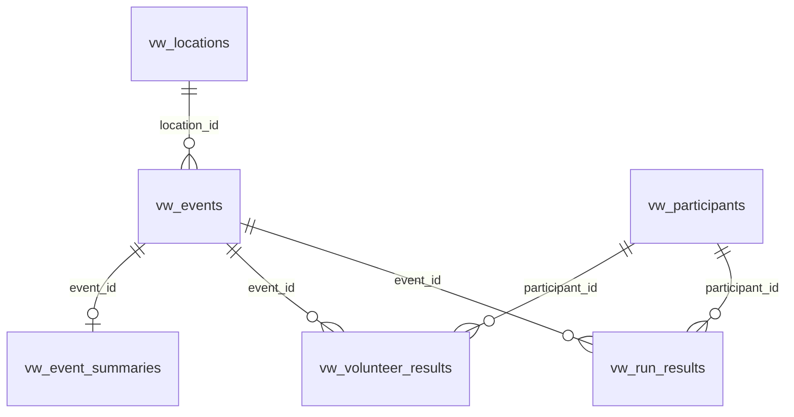

## Общие требования

| Требование | Описание |
|------------|----------|
| Доступ | Отдельный пользователь БД, **только SELECT** на view ниже |
| Схема | Рекомендуем `runpark_export` (можно другую — сообщите) |
| Стабильные ID | Поля `*_id` не меняются при переименовании локации/участника |
| Синхронизация | На каждой view желательно поле `updated_at` (timestamptz) |
| Удаления | Желательно `is_deleted boolean` или `deleted_at timestamptz` вместо физического DELETE |
| Тестовые события | Флаг `is_test_event` — мы скрываем их в UI по умолчанию |
| Часовой пояс | `event_date` — календарная дата забега; `timestamptz` — UTC или с явным offset |

**Не включать во view:** пароли, email, телефоны, платежи, внутренние админ-заметки, черновики неопубликованных протоколов.

---

## Набор view (MVP)

| View | Назначение |
|------|------------|
| `vw_locations` | Справочник площадок |
| `vw_participants` | Профили участников (для привязки и превью) |
| `vw_events` | События (забеги) |
| `vw_run_results` | Результаты пробежек |
| `vw_volunteer_results` | Волонтёрство |
| `vw_event_summaries` | *(опционально)* агрегаты по событию |

DDL-шаблон: [`database_views.sql`](./database_views.sql)

---

## 1. `runpark_export.vw_locations`

Одна строка = одна площадка.

| Поле | Тип | NULL | Описание |
|------|-----|------|----------|
| `location_id` | text | нет | Стабильный ключ (slug или UUID в строке). **PK view** |
| `name` | text | нет | Отображаемое название |
| `city` | text | да | Город |
| `region` | text | да | Регион / субъект РФ |
| `country` | text | да | ISO или текст, напр. `RU` |
| `latitude` | double precision | да | WGS-84, для карты |
| `longitude` | double precision | да | WGS-84, для карты |
| `is_active` | boolean | нет | Локация существует в системе (default `true`) |
| `is_paused` | boolean | нет | Временно не проводятся забеги (default `false`) |
| `public_url` | text | да | Публичная страница локации |
| `map_url` | text | да | Ссылка на карту маршрута |
| `legacy_parkrun_slug` | text | да | Slug parkrun, если известен (склейка локаций) |
| `legacy_five_verst_slug` | text | да | Slug 5 вёрст, если известен |
| `legacy_s95_slug` | text | да | Slug С95, если известен |
| `updated_at` | timestamptz | да | Последнее изменение записи |
| `is_deleted` | boolean | нет | Мягкое удаление (default `false`) |

---

## 2. `runpark_export.vw_participants`

Профиль участника. ID используется при привязке аккаунта в Saturday Runs.

| Поле | Тип | NULL | Описание |
|------|-----|------|----------|
| `participant_id` | text | нет | Стабильный ID в RunPark. **PK view** |
| `display_name` | text | нет | Имя в протоколах |
| `profile_url` | text | нет | Публичный URL профиля |
| `total_runs` | integer | да | Всего финишей (если хранится) |
| `total_volunteering` | integer | да | Всего волонтёрств (если хранится) |
| `club_name` | text | да | Клуб / команда |
| `barcode_id` | text | да | Штрихкод / номер участника |
| `planning_location_id` | text | да | FK → `location_id`, «домашняя» площадка |
| `age_category` | text | да | Текущая или основная возрастная группа |
| `updated_at` | timestamptz | да | |
| `is_deleted` | boolean | нет | default `false` |

---

## 3. `runpark_export.vw_events`

Одно событие = один забег на площадке в конкретную дату.

| Поле | Тип | NULL | Описание |
|------|-----|------|----------|
| `event_id` | text | нет | Стабильный ID события. **PK view** |
| `location_id` | text | нет | FK → `vw_locations.location_id` |
| `event_date` | date | нет | Дата забега |
| `event_number` | integer | да | Порядковый номер на площадке (#94) |
| `title` | text | да | Заголовок / подпись события |
| `is_test_event` | boolean | нет | Тестовое мероприятие (default `false`) |
| `finishers_count` | integer | да | Число финишировавших |
| `public_url` | text | да | Страница протокола / события |
| `updated_at` | timestamptz | да | |
| `is_deleted` | boolean | нет | default `false` |

**Уникальность:** `event_id`. Если ID нет — допустима пара `(location_id, event_date)` при условии одного забега в день на площадке.

---

## 4. `runpark_export.vw_run_results`

Результат одного участника на одном событии.

| Поле | Тип | NULL | Описание |
|------|-----|------|----------|
| `result_id` | text | нет | Уникальный ID результата. **PK view** |
| `event_id` | text | нет | FK → `vw_events.event_id` |
| `participant_id` | text | нет | FK → `vw_participants.participant_id` |
| `event_date` | date | нет | Дублируется для выборок по пользователю |
| `location_id` | text | нет | FK → `vw_locations.location_id` |
| `location_name` | text | да | Название локации (если без JOIN) |
| `event_number` | integer | да | Номер забега на площадке |
| `position` | integer | да | Место в протоколе |
| `finish_time_sec` | integer | да | Время финиша в секундах (предпочтительно) |
| `finish_time_display` | text | да | Строка `MM:SS` или `HH:MM:SS`, если секунд нет |
| `pace_sec_per_km` | integer | да | Темп, сек/км (если дистанция стандартная) |
| `age_category` | text | да | Возрастная группа на этом забеге |
| `status` | text | да | Статус: `finished`, `DNF`, `DNS` и т.п. |
| `is_pr` | boolean | нет | Личный рекорд на момент протокола (default `false`) |
| `is_test_event` | boolean | нет | default `false` |
| `updated_at` | timestamptz | да | |
| `is_deleted` | boolean | нет | default `false` |

**Типичные запросы Saturday Runs:**

```sql
-- история пользователя
SELECT * FROM runpark_export.vw_run_results
WHERE participant_id = $1 AND is_deleted = false
ORDER BY event_date DESC;

-- инкремент
SELECT * FROM runpark_export.vw_run_results
WHERE updated_at > $since;
```

**Уникальность:** `result_id` или `(event_id, participant_id)`.

---

## 5. `runpark_export.vw_volunteer_results`

Одна строка = одна роль волонтёра на одном событии.

| Поле | Тип | NULL | Описание |
|------|-----|------|----------|
| `volunteer_id` | text | нет | Уникальный ID записи. **PK view** |
| `event_id` | text | нет | FK → `vw_events.event_id` |
| `participant_id` | text | да | FK → participant; NULL если в протоколе только имя |
| `participant_name` | text | да | Имя, если `participant_id` неизвестен |
| `event_date` | date | нет | |
| `location_id` | text | нет | |
| `location_name` | text | да | |
| `event_number` | integer | да | |
| `role` | text | нет | Роль **как в UI RunPark** (Судья, Organizer, …) |
| `is_test_event` | boolean | нет | default `false` |
| `updated_at` | timestamptz | да | |
| `is_deleted` | boolean | нет | default `false` |

**Уникальность:** `volunteer_id` или `(event_id, participant_id, role)` при одной роли на человека.

---

## 6. `runpark_export.vw_event_summaries` *(опционально)*

Агрегированная статистика события. Если данных нет — view можно не делать; мы посчитаем из `vw_run_results`.

| Поле | Тип | NULL | Описание |
|------|-----|------|----------|
| `event_id` | text | нет | FK → `vw_events.event_id` |
| `finishers_count` | integer | да | |
| `volunteers_count` | integer | да | |
| `avg_time_sec` | integer | да | Среднее время |
| `avg_time_display` | text | да | |
| `best_male_time_sec` | integer | да | |
| `best_male_time_display` | text | да | |
| `best_female_time_sec` | integer | да | |
| `best_female_time_display` | text | да | |
| `updated_at` | timestamptz | да | |

---

## Связи между view



---

## Что нужно от RunPark дополнительно

1. **Read-only credentials** (host, port, database, user, password, SSL).
2. **Staging** с 2–3 локациями и тестовыми участниками для проверки интеграции.
3. **Оценка объёма:** число локаций, событий, результатов, частота обновлений.
4. **Политика изменений:** предупреждение перед переименованием колонок / сменой типов.
5. Подтверждение, что во view попадают **только опубликованные** протоколы.

---

## Проверка после реализации

```sql
-- структура view
SELECT column_name, data_type, is_nullable
FROM information_schema.columns
WHERE table_schema = 'runpark_export'
ORDER BY table_name, ordinal_position;

-- smoke
SELECT count(*) FROM runpark_export.vw_locations WHERE is_deleted = false;
SELECT count(*) FROM runpark_export.vw_participants WHERE is_deleted = false;
SELECT count(*) FROM runpark_export.vw_run_results WHERE is_deleted = false;
```

---

## Версия контракта

| Версия | Дата | Изменения |
|--------|------|-----------|
| 1.0 | 2026-05-27 | Первоначальная версия |

При изменении контракта меняем версию и согласуем миграцию с Saturday Runs.
