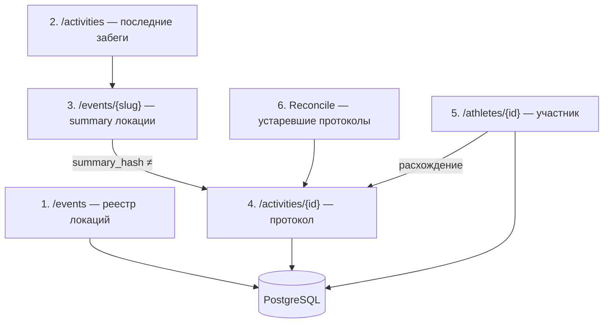

# План конвейеров синхронизации S95

Документ фиксирует целевую архитектуру сбора данных с [s95.ru](https://s95.ru) (и зеркал `.by` / `.rs`).  
**Наполнение dev БД парсингом не делаем** — после завершения конвейеров данные переносим из legacy `five_verst_stats` (см. [deploy_and_migration_plan.md](./deploy_and_migration_plan.md)).

Образец структуры: [five_verst_sync_plan.md](./five_verst_sync_plan.md).

---

## URL и страницы

| Страница | URL | Назначение |
|----------|-----|------------|
| Реестр локаций | `https://s95.ru/events` | Список всех площадок + статус на сайте |
| Последние забеги | `https://s95.ru/activities` | Latest-сводки + ссылки на протоколы |
| Локация (summary) | `https://s95.ru/events/{slug}` | Саммари протоколов, coords, карта |
| Протокол | `https://s95.ru/activities/{id}` | Бег + волонтёры + очки/бейджи |
| Участник | `https://s95.ru/athletes/{id}` | Профиль, пробежки, «куда в субботу» |

Примеры:
- [activities/4098](https://s95.ru/activities/4098) — 70 finisher, 16 PR, 5 «впервые на локации», 6 «впервые на S95»
- [events/angarskie_prudy](https://s95.ru/events/angarskie_prudy)
- [athletes/6514](https://s95.ru/athletes/6514)

---

## Пауза vs отмена (общее для 5verst + S95 + карта)

| Статус | Критерий | UI на карте |
|--------|----------|-------------|
| **Активна** | Есть недавние события / нет маркеров на сайте | Цвет системы |
| **На паузе** (`is_paused`) | На сайте «на паузе» **или** нет пробежек **≥ N недель** (по умолчанию 5) | Серый маркер (уже есть) |
| **Отменена** (`is_cancelled`) | Явная отмена на сайте (`отмена` / cancelled) | **Чёрный** маркер + подпись в таблице локаций |

Миграция: `locations.is_cancelled` (bool, default false).  
Эвристика паузы по неактивности — отдельный job `mark_inactive_locations_paused` (платформо-независимый).

5verst: статус с `/events/` уже в registry sync → дополнить маппинг `cancelled` → `is_cancelled`.  
S95: парсер реестра `/events` → те же поля.

---

## Текущее состояние кода

| Область | Есть | Не хватает |
|---------|------|------------|
| Fetch (Playwright, lock, rate limit) | ✅ `app/s95/fetch/` | — |
| Парсер `/activities` | ✅ `parsers/activities.py` | Celery, тесты, hash-change logic |
| Парсер summary локации | ✅ `parsers/summary.py`, `location.py` | Registry «только новые ID» |
| Парсер протокола | ✅ `parsers/protocol.py` | PR only; нет бейджей/очков/club |
| Парсер athlete | ✅ `parsers/athlete.py` | `planning_location` есть; нет `profile_fetched_at` / mismatch→protocol |
| Sync activities | ✅ `sync/s95_activities_sync.py` | Как 5verst latest + protocol module |
| Sync location (полный) | ✅ `sync/s95_location_sync.py` | Backfill / reconcile |
| Sync athlete | ✅ `sync/s95_athletes_sync.py` | Auto re-parse протоколов |
| User sync | ✅ `sync/s95_user_sync.py` | `missing_runs` → fetch protocol |
| Protocol sync state | ✅ таблица `protocol_sync_states` | Только 5verst использует |
| Celery | ✅ `user`, `location`, `global_pipeline`, beat (+30 мин vs 5v) | — |
| Локации в БД | CSV import | Live registry |

---

## Целевые конвейеры

---

## Скрипты (целевые)

| # | Скрипт | URL | Действие |
|---|--------|-----|----------|
| 1 | `s95_sync_registry` | `/events` | `locations`: name, `is_paused`, `is_cancelled`; **новый slug** → coords + map |
| 2 | `s95_sync_latest` | `/activities` | summaries → при new/changed → протокол |
| 3 | `s95_sync_location` | `/events/{slug}` | summaries; при hash ≠ → протокол; обновить coords |
| 4 | *(inline)* | `/activities/{id}` | run_results, volunteer_results, achievements, participants |
| 5 | `s95_reconcile_protocols` | протокол | stale + `protocol_sync_states` |
| 6 | `s95_sync_athlete` | `/athletes/{id}` | профиль, runs, planning; mismatch → протокол |
| 7 | `s95_sync_athletes_registry` | *(TBD)* | обход участников с `participants.fetched_at` |

---

## Фаза A — реестр локаций ✅

| # | Задача | Статус |
|---|--------|--------|
| A1 | Парсер `https://s95.ru/events` — slug, name, status (active / paused / cancelled) | ✅ `s95/parsers/events_registry.py` |
| A2 | `sync_s95_locations_registry()` — upsert meta; **fetch detail только для новых slug** | ✅ `sync/s95_locations_registry.py`, CLI `s95_sync_registry.py` |
| A3 | Миграция `locations.is_cancelled`; UI чёрный маркер на карте | ✅ migration 022, карта + таблица |
| A4 | Job неактивности: нет event ≥ 5 недель → `is_paused` (если не cancelled) | ✅ `mark_inactive_locations_paused.py` |

**5verst:** `cancelled` больше не мапится в `is_paused` — отдельно `is_cancelled`.

**Логика A2:** если slug уже в БД и coords есть — не заходить в `/events/{slug}`.  
Если slug новый — `parse_event_location_page()` + reverse geocode + `is_official_map`.

---

## Фаза B — события и протоколы ✅

| # | Задача | Статус |
|---|--------|--------|
| B1 | `sync_s95_latest()` | ✅ `sync/s95_latest.py`, CLI `s95_sync_latest.py` |
| B2 | При смене hash / missing event → протокол | ✅ `s95_summary_plan.py` |
| B3 | `s95_protocol.py` + `ProtocolSyncState` | ✅ |
| B4 | Бейджи/очки в протоколе | ✅ `s95/parsers/achievements.py`, `summary_extra` |
| B5 | `sync_s95_location()` + `--fetch-all` логика | ✅ через `fetch_all_protocols_on_change` |

**Очки на протоколе** (шапка activity, пример 4098):
- «16 число личных рекордов»
- «5 впервые на забеге {локация}»
- «6 впервые на забеге S95»

Парсить в `EventSummary.extra` / отдельные поля + дублировать на строках где возможно.

---

## Фаза C — reconcile и наблюдаемость ✅

| # | Задача | Статус |
|---|--------|--------|
| C1 | `s95_reconcile.py` — shared `protocol_sync_states` | ✅ |
| C2 | `SyncRun` типы: `s95:latest`, `s95:location:*`, `s95:reconcile_protocols`, `s95:registry` | ✅ |
| C3 | CLI: `s95_sync_registry`, `s95_sync_latest`, `s95_reconcile_protocols` | ✅ |
| C4 | Celery tasks (без prod cron) | ✅ |

**Правило:** любой просмотр протокола (даже без изменений) → `last_protocol_check_at`; fetch → `last_protocol_fetched_at` + hash.

---

## Фаза D — участники ✅

| # | Задача | Статус |
|---|--------|--------|
| D1 | При sync athlete: `fetched_at` + **`planning_location` + `planning_location_seen_at`** | ✅ миграция `024`, `s95_participant_sync.py` |
| D2 | Блок «Собирается в …» + timestamp наблюдения | ✅ preview + admin |
| D3 | **Mismatch detection:** последние N пробежек vs `run_results` → re-fetch protocol | ✅ `s95_athlete_mismatch.py` |
| D4 | Admin-таблица участников с `fetched_at` | ✅ `/admin/s95-participants` |
| D5 | `s95_sync_athletes_registry` — `fetched_at ASC`, лимит N | ✅ CLI + Celery |

**Ключ протокола S95:** `external_event_key` = `{slug}:{date}` или activity id в `source_url` — зафиксировать в `s95_protocol.py`.

---

## Фаза E — UX (единая страница пробежек) ✅

| # | Задача | Статус |
|---|--------|--------|
| E1 | Runs page: badge paused / cancelled рядом с локацией | ✅ `location_is_paused/cancelled` в API |
| E2 | Volunteering — то же | ✅ |
| E3 | Карта: чёрный маркер для `is_cancelled` | ✅ (фаза A) |
| E4 | «Список локаций» — колонка/фильтр статуса | ✅ колонка «Статус» + фильтр |

---

## Фаза F — prod и legacy

| # | Задача |
|---|--------|
| F1 | ETL из legacy `s95_details_protocol` / `s95_location` (см. deploy plan) |
| F2 | Сверка counts по slug / activity id |
| F3 | Celery beat на prod |

---

## Порядок реализации

1. **A3 + pause/cancel UX** — миграция `is_cancelled`, карта, таблица локаций (общее с 5verst)
2. **A1–A2** — registry S95
3. **B3–B4** — protocol module + achievements
4. **B1–B2** — latest sync (refactor activities)
5. **C1–C4** — reconcile + CLI + Celery
6. **D1–D5** — athlete mismatch + planning timestamp
7. **E1–E4** — badges на Runs/Volunteering
8. **F** — после согласования — только legacy ETL, без scrape-backfill

---

## Риски

| Риск | Решение |
|------|---------|
| Turbo-frames / «Загрузка…» на athlete | Retry fetch (уже частично в athlete sync) |
| Неизвестный участник в протоколе | `unknown:{name}` — как сейчас |
| Тихие правки протокола | Reconcile + athlete mismatch |
| .by / .rs зеркала | Один парсер, `base_url` из platform config |
| Playwright ban | Shared coordinator + cooldown (как сейчас) |

---

## Связь с существующим кодом

| Новое | От чего отталкиваемся |
|-------|----------------------|
| `s95_protocol.py` | `five_verst_protocol.py` |
| `s95_reconcile.py` | `five_verst_reconcile.py` |
| `s95_locations_registry.py` | `five_verst_locations.py` |
| `s95_latest.py` | `five_verst_latest.py` + `s95_activities_sync.py` |
| Achievements в protocol | `five_verst/bulk_parser.py` + HTML S95 activity page |

---

## Celery Beat (prod, MSK)

Расписание S95 — **+30 мин** относительно 5verst (см. `celery_app.py`):

| Beat key | Task | Расписание |
|----------|------|------------|
| `s95-registry-daily` | `sync_locations_registry` | 20:30 |
| `s95-latest-*` | `sync_latest` | :30 (hourly в сб/вс, 05:30 пн–пт) |
| `s95-location-rotation` | `sync_location_rotation` | каждые 4 ч, :30 |
| `s95-reconcile-protocols` | `reconcile_stale_protocols` | каждые 3 ч, :30 |
| `s95-athletes-registry` | `sync_athletes_registry` | каждые 2 ч, :30, batch 50 |

VK-репорты: `run_reported_sync()` для всех scheduled tasks. Dedup: `scheduled_sync_guard.py` (1 прогон/pipeline/час MSK).

Athletes: `profile_checked_at` в `profile_extra`, перепроверка через `s95_athlete_profile_recheck_interval_days` (default 30).

**Справочник для агентов:** [AGENTS.md](../AGENTS.md)
